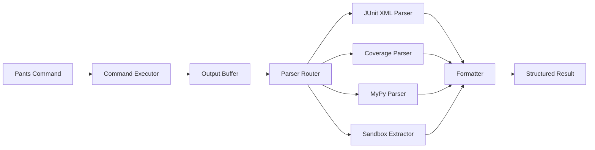

# Design Document: Enhanced Pants Output Capture

## Overview

This design refactors the kiro-pants-power output capture system to provide structured data extraction and enhanced error diagnostics for AI agents. The current implementation captures raw stdout/stderr but lacks parsing capabilities for structured formats (JUnit XML, coverage reports, MyPy output) and detailed error context.

The enhanced system will:

- Parse JUnit XML test reports to extract structured test results
- Parse coverage reports (JSON/XML) to provide coverage metrics
- Extract MyPy type checking errors with file locations and error details
- Extract sandbox paths from Pants logs for artifact inspection
- Format enhanced error diagnostics with actionable information
- Support streaming progress for long-running operations
- Provide workflow step progress in multi-step quality checks
- Handle parsing errors gracefully with fallback to raw output

This refactor addresses agent feedback requesting detailed error information instead of raw output dumps, enabling agents to make informed decisions about code quality issues.

## Architecture

### High-Level Architecture

The enhanced output capture system follows a pipeline architecture:

```
Command Execution → Output Capture → Parsing → Formatting → Agent Response
```



### Component Layers

1. **Execution Layer**: CommandExecutor executes Pants commands and captures output
2. **Capture Layer**: OutputBuffer stores both streaming and complete output
3. **Parsing Layer**: Specialized parsers extract structured data from output and report files
4. **Formatting Layer**: Error formatters create actionable summaries for agents
5. **Integration Layer**: Enhanced PantsCommands and WorkflowOrchestrator coordinate the pipeline

### Design Principles

- **Graceful Degradation**: Parsing failures never fail the command; fall back to raw output
- **Separation of Concerns**: Each parser handles one output format independently
- **Extensibility**: New parsers can be added without modifying existing components
- **Agent-First**: Output format optimized for agent consumption, not human reading
- **Performance**: Parsing happens asynchronously; doesn't block command execution

## Components and Interfaces

### 1. OutputBuffer

**Purpose**: Capture and store command output for both streaming and final parsing.

**Responsibilities**:
- Buffer output lines during command execution
- Support both streaming and buffered modes
- Preserve output ordering (stdout/stderr interleaving)
- Provide complete output for parsing after execution

**Interface**:
```python
class OutputBuffer:
    def append_line(self, line: str, stream: str) -> None:
        """Append a line from stdout or stderr."""
        
    def get_complete_output(self) -> tuple[str, str]:
        """Return complete stdout and stderr."""
        
    def get_interleaved_output(self) -> str:
        """Return stdout and stderr in execution order."""
```

### 2. JUnitXMLParser

**Purpose**: Parse JUnit XML test report files into structured test results.

**Responsibilities**:
- Locate JUnit XML files in configured output directory
- Parse XML to extract test cases, status, timing, and failure details
- Aggregate results across multiple report files
- Handle malformed XML gracefully

**Interface**:
```python
class JUnitXMLParser:
    def parse_reports(self, report_dir: str) -> TestResults:
        """Parse all JUnit XML files in directory."""
        
    def parse_single_report(self, xml_path: str) -> TestResults:
        """Parse a single JUnit XML file."""

@dataclass
class TestResults:
    total_count: int
    pass_count: int
    fail_count: int
    skip_count: int
    failures: list[TestFailure]
    execution_time: float

@dataclass
class TestFailure:
    test_name: str
    test_file: str
    failure_type: str
    failure_message: str
    stack_trace: str | None
```

### 3. CoverageReportParser

**Purpose**: Parse coverage reports in JSON or XML format.

**Responsibilities**:
- Detect coverage report format (JSON/XML)
- Extract overall coverage percentage
- Extract per-file coverage metrics
- Extract uncovered line ranges
- Handle missing coverage data gracefully

**Interface**:
```python
class CoverageReportParser:
    def parse_coverage(self, report_path: str) -> CoverageData:
        """Parse coverage report (auto-detects format)."""
        
    def parse_json_coverage(self, json_path: str) -> CoverageData:
        """Parse JSON coverage report."""
        
    def parse_xml_coverage(self, xml_path: str) -> CoverageData:
        """Parse XML (Cobertura) coverage report."""

@dataclass
class CoverageData:
    total_coverage: float
    file_coverage: dict[str, FileCoverage]
    
@dataclass
class FileCoverage:
    file_path: str
    coverage_percent: float
    covered_lines: int
    total_lines: int
    uncovered_ranges: list[tuple[int, int]]
```

### 4. MyPyOutputParser

**Purpose**: Extract type checking errors from MyPy console output.

**Responsibilities**:
- Parse MyPy error lines from stdout/stderr
- Extract file path, line number, error code, and message
- Aggregate errors by file
- Preserve MyPy report file paths when available
- Handle MyPy summary statistics

**Interface**:
```python
class MyPyOutputParser:
    def parse_output(self, output: str) -> TypeCheckResults:
        """Parse MyPy errors from console output."""
        
    def extract_error_line(self, line: str) -> TypeCheckError | None:
        """Parse a single MyPy error line."""

@dataclass
class TypeCheckResults:
    error_count: int
    errors_by_file: dict[str, list[TypeCheckError]]
    report_paths: list[str]
    
@dataclass
class TypeCheckError:
    file_path: str
    line_number: int
    column: int | None
    error_code: str
    error_message: str
```

### 5. SandboxPathExtractor

**Purpose**: Extract sandbox directory paths from Pants log output.

**Responsibilities**:
- Parse Pants log messages for sandbox preservation notices
- Extract full sandbox directory paths
- Associate sandbox paths with process descriptions
- Handle both `--keep-sandboxes=always` and `on_failure` modes

**Interface**:
```python
class SandboxPathExtractor:
    def extract_sandboxes(self, output: str) -> list[SandboxInfo]:
        """Extract all sandbox paths from Pants output."""
        
    def extract_sandbox_line(self, line: str) -> SandboxInfo | None:
        """Parse a single sandbox preservation log line."""

@dataclass
class SandboxInfo:
    sandbox_path: str
    process_description: str
    timestamp: str | None
```

### 6. PytestOutputParser

**Purpose**: Parse pytest console output for detailed failure information.

**Responsibilities**:
- Extract pytest short test summary (FAILED lines)
- Parse assertion failure details (expected vs actual)
- Extract relevant stack trace frames
- Identify failure types (AssertionError, Exception, etc.)
- Format failures in structured format

**Interface**:
```python
class PytestOutputParser:
    def parse_output(self, output: str) -> PytestResults:
        """Parse pytest console output for failures."""
        
    def extract_failure_summary(self, output: str) -> list[str]:
        """Extract FAILED test lines from summary."""
        
    def extract_assertion_details(self, output: str) -> list[AssertionFailure]:
        """Parse assertion failure details."""

@dataclass
class PytestResults:
    failed_tests: list[PytestFailure]
    
@dataclass
class PytestFailure:
    test_name: str
    test_file: str
    failure_type: str
    failure_message: str
    assertion_details: AssertionFailure | None
    stack_trace_excerpt: str | None

@dataclass
class AssertionFailure:
    expected_value: str
    actual_value: str
    comparison_operator: str
```

### 7. ConfigurationParser

**Purpose**: Parse and format Pants configuration files (pants.toml).

**Responsibilities**:
- Parse TOML configuration files into structured objects
- Validate configuration against Pants schema
- Provide descriptive errors for syntax issues
- Support round-trip parsing (parse → format → parse)

**Interface**:
```python
class ConfigurationParser:
    def parse_config(self, config_path: str) -> Configuration:
        """Parse pants.toml into Configuration object."""
        
    def validate_config(self, config: Configuration) -> list[ValidationError]:
        """Validate configuration against Pants schema."""

class ConfigurationPrettyPrinter:
    def format_config(self, config: Configuration) -> str:
        """Format Configuration object back to TOML."""
        
    def preserve_comments(self, original: str, formatted: str) -> str:
        """Preserve comments from original file."""

@dataclass
class Configuration:
    sections: dict[str, dict[str, Any]]
    comments: dict[str, str]
```

### 8. EnhancedErrorFormatter

**Purpose**: Format structured parsing results into actionable error summaries.

**Responsibilities**:
- Create concise error summaries from parsed data
- Categorize errors by type (test failure, type error, execution error)
- Limit output to most relevant information
- Include sandbox paths when available
- Format for agent consumption (structured, not prose)

**Interface**:
```python
class EnhancedErrorFormatter:
    def format_test_failures(self, results: TestResults) -> str:
        """Format test failure summary."""
        
    def format_type_errors(self, results: TypeCheckResults) -> str:
        """Format type checking error summary."""
        
    def format_coverage_summary(self, coverage: CoverageData) -> str:
        """Format coverage metrics summary."""
        
    def format_error_summary(
        self,
        command_result: CommandResult,
        test_results: TestResults | None,
        type_results: TypeCheckResults | None,
        coverage: CoverageData | None,
        sandboxes: list[SandboxInfo]
    ) -> str:
        """Format complete error diagnostic."""
```

### 9. ParserRouter

**Purpose**: Route output to appropriate parsers based on command type.

**Responsibilities**:
- Determine which parsers to invoke based on command
- Locate report files in expected directories
- Coordinate parsing across multiple parsers
- Handle parsing errors and fallback logic
- Return unified parsing results

**Interface**:
```python
class ParserRouter:
    def parse_command_output(
        self,
        command: str,
        result: CommandResult,
        report_dir: str
    ) -> ParsedOutput:
        """Route output to appropriate parsers."""
        
    def get_parsers_for_command(self, command: str) -> list[Parser]:
        """Determine which parsers to use for command."""

@dataclass
class ParsedOutput:
    test_results: TestResults | None
    coverage_data: CoverageData | None
    type_check_results: TypeCheckResults | None
    pytest_results: PytestResults | None
    sandboxes: list[SandboxInfo]
    parsing_errors: list[str]
```

### 10. Enhanced PantsCommands

**Purpose**: Integrate parsing and formatting into command execution.

**Responsibilities**:
- Configure Pants commands with appropriate flags for structured output
- Execute commands and capture output
- Route output to parsers
- Format results using EnhancedErrorFormatter
- Return enhanced CommandResult with structured data

**Interface**:
```python
class EnhancedPantsCommands(PantsCommands):
    def __init__(
        self,
        container_manager: ContainerManager | None = None,
        command_builder: PantsCommandBuilder | None = None,
        parser_router: ParserRouter | None = None,
        formatter: EnhancedErrorFormatter | None = None
    ):
        """Initialize with parsing and formatting components."""
        
    def pants_test(
        self,
        target: str | None = None,
        enable_coverage: bool = True
    ) -> EnhancedCommandResult:
        """Execute test with enhanced output parsing."""
        
    def pants_check(self, target: str | None = None) -> EnhancedCommandResult:
        """Execute check with MyPy error parsing."""

@dataclass
class EnhancedCommandResult(CommandResult):
    parsed_output: ParsedOutput
    formatted_summary: str
```

### 11. Enhanced WorkflowOrchestrator

**Purpose**: Provide workflow step progress and enhanced error reporting.

**Responsibilities**:
- Track completion status of each workflow step
- Report step completion with timing information
- Provide workflow summary on completion or failure
- Include enhanced diagnostics for failed steps
- Support streaming progress callbacks

**Interface**:
```python
class EnhancedWorkflowOrchestrator(WorkflowOrchestrator):
    def execute_workflow(
        self,
        steps: list[str],
        target: str | None = None,
        progress_callback: Callable[[WorkflowProgress], None] | None = None
    ) -> EnhancedWorkflowResult:
        """Execute workflow with enhanced progress tracking."""

@dataclass
class WorkflowProgress:
    current_step: int
    total_steps: int
    step_name: str
    status: str  # "starting", "running", "completed", "failed"
    elapsed_time: float | None

@dataclass
class EnhancedWorkflowResult(WorkflowResult):
    step_timings: dict[str, float]
    enhanced_results: list[EnhancedCommandResult]
    workflow_summary: str
```

## Data Models

### Core Result Models

```python
@dataclass
class CommandResult:
    """Base result from command execution."""
    exit_code: int
    stdout: str
    stderr: str
    command: str
    success: bool
    
    @property
    def output(self) -> str:
        """Combined stdout and stderr."""
        return f"{self.stdout}\n{self.stderr}".strip()

@dataclass
class EnhancedCommandResult(CommandResult):
    """Command result with parsed structured data."""
    parsed_output: ParsedOutput
    formatted_summary: str
    execution_time: float

@dataclass
class ParsedOutput:
    """Aggregated parsing results from all parsers."""
    test_results: TestResults | None = None
    coverage_data: CoverageData | None = None
    type_check_results: TypeCheckResults | None = None
    pytest_results: PytestResults | None = None
    sandboxes: list[SandboxInfo] = field(default_factory=list)
    parsing_errors: list[str] = field(default_factory=list)
```

### Test Result Models

```python
@dataclass
class TestResults:
    """Structured test execution results from JUnit XML."""
    total_count: int
    pass_count: int
    fail_count: int
    skip_count: int
    failures: list[TestFailure]
    execution_time: float

@dataclass
class TestFailure:
    """Details of a single test failure."""
    test_name: str
    test_file: str
    test_class: str | None
    failure_type: str
    failure_message: str
    stack_trace: str | None

@dataclass
class PytestResults:
    """Pytest-specific failure details."""
    failed_tests: list[PytestFailure]

@dataclass
class PytestFailure:
    """Detailed pytest failure information."""
    test_name: str
    test_file: str
    failure_type: str
    failure_message: str
    assertion_details: AssertionFailure | None
    stack_trace_excerpt: str | None

@dataclass
class AssertionFailure:
    """Assertion failure details."""
    expected_value: str
    actual_value: str
    comparison_operator: str
```

### Coverage Models

```python
@dataclass
class CoverageData:
    """Code coverage metrics."""
    total_coverage: float
    file_coverage: dict[str, FileCoverage]
    report_path: str

@dataclass
class FileCoverage:
    """Per-file coverage information."""
    file_path: str
    coverage_percent: float
    covered_lines: int
    total_lines: int
    uncovered_ranges: list[tuple[int, int]]
```

### Type Checking Models

```python
@dataclass
class TypeCheckResults:
    """MyPy type checking results."""
    error_count: int
    errors_by_file: dict[str, list[TypeCheckError]]
    report_paths: list[str]

@dataclass
class TypeCheckError:
    """Single type checking error."""
    file_path: str
    line_number: int
    column: int | None
    error_code: str
    error_message: str
```

### Sandbox Models

```python
@dataclass
class SandboxInfo:
    """Preserved sandbox information."""
    sandbox_path: str
    process_description: str
    timestamp: str | None
```

### Configuration Models

```python
@dataclass
class Configuration:
    """Pants configuration file structure."""
    sections: dict[str, dict[str, Any]]
    comments: dict[str, str]
    source_file: str

@dataclass
class ValidationError:
    """Configuration validation error."""
    section: str
    option: str
    message: str
    line_number: int | None
```

### Workflow Models

```python
@dataclass
class WorkflowResult:
    """Multi-step workflow execution result."""
    steps_completed: list[str]
    failed_step: str | None
    results: list[CommandResult]
    overall_success: bool
    
    @property
    def summary(self) -> str:
        """Human-readable workflow summary."""

@dataclass
class EnhancedWorkflowResult(WorkflowResult):
    """Workflow result with enhanced diagnostics."""
    step_timings: dict[str, float]
    enhanced_results: list[EnhancedCommandResult]
    workflow_summary: str

@dataclass
class WorkflowProgress:
    """Real-time workflow progress information."""
    current_step: int
    total_steps: int
    step_name: str
    status: str  # "starting", "running", "completed", "failed"
    elapsed_time: float | None
```


## Correctness Properties

A property is a characteristic or behavior that should hold true across all valid executions of a system—essentially, a formal statement about what the system should do. Properties serve as the bridge between human-readable specifications and machine-verifiable correctness guarantees.

### Property Reflection

After analyzing all 66 acceptance criteria, several redundancies were identified:

- Requirements 1.3 and 1.6 both specify required fields in test results (can be combined)
- Requirements 2.1 and 1.1 follow the same pattern for checking report files (can be generalized)
- Requirements 2.4 and 2.5 both specify required fields in coverage data (can be combined)
- Requirements 3.2 and 3.5 both specify required fields in type check results (can be combined)
- Requirements 3.6 and 5.5 both address preserving MyPy report paths (can be combined)
- Requirements 5.1, 5.3, 5.4, 5.6 are all configuration examples (can be tested together)
- Multiple formatter requirements (1.4, 6.3, 6.4, 6.6) specify required content (can be generalized)

The following properties eliminate redundancy while maintaining comprehensive coverage:

### Property 1: JUnit XML Parsing Completeness

For any valid JUnit XML test report file, parsing the file should produce a TestResults object containing all required fields: total_count, pass_count, fail_count, skip_count, test case names, status values, execution times, and failure messages for failed tests.

**Validates: Requirements 1.2, 1.3, 1.6**

### Property 2: JUnit XML Aggregation Correctness

For any collection of JUnit XML report files, the aggregated TestResults should have totals (total_count, pass_count, fail_count, skip_count) that equal the sum of the individual file results, and the failures list should contain all failures from all files.

**Validates: Requirements 1.5**

### Property 3: Report File Detection

For any configured output directory and report type (JUnit XML, coverage JSON, coverage XML), if report files of that type exist in the directory, the Output_Capture_System should detect and attempt to parse them.

**Validates: Requirements 1.1, 2.1**

### Property 4: Coverage Report Parsing Completeness

For any valid coverage report file (JSON or XML format), parsing the file should produce a CoverageData object containing all required fields: total_coverage percentage, per-file coverage metrics (file_path, coverage_percent, covered_lines, total_lines), and uncovered line ranges.

**Validates: Requirements 2.2, 2.3, 2.4, 2.5**

### Property 5: MyPy Error Extraction Completeness

For any MyPy console output containing type errors, parsing the output should extract all error lines and produce a TypeCheckResults object with all required fields: error_count, errors grouped by file, and for each error: file_path, line_number, error_code, and error_message.

**Validates: Requirements 3.1, 3.2, 3.5**

### Property 6: MyPy Error Aggregation by File

For any MyPy output containing errors from multiple files, the TypeCheckResults should group all errors by their file_path, with each file having a list of all its errors.

**Validates: Requirements 3.4**

### Property 7: MyPy Report Path Preservation

For any MyPy execution that generates report files, the TypeCheckResults should include the paths to all generated report files in the report_paths list.

**Validates: Requirements 3.6, 5.5**

### Property 8: Sandbox Path Extraction Completeness

For any Pants log output containing N sandbox preservation messages, the Sandbox_Path_Extractor should extract exactly N SandboxInfo objects, each containing the full sandbox_path and associated process_description.

**Validates: Requirements 4.1, 4.2, 4.3, 4.5**

### Property 9: Test Failure Formatting Completeness

For any TestResults containing failures, the formatted error summary should include all required information for each failure: test_name, failure_type, failure_message, and stack_trace location (if available).

**Validates: Requirements 1.4, 6.3**

### Property 10: Type Error Formatting Completeness

For any TypeCheckResults containing errors, the formatted error summary should list all files with errors, include error counts per file, and include sample errors with file location, line number, and error description.

**Validates: Requirements 3.3, 6.4**

### Property 11: Sandbox Path Inclusion in Error Output

For any failed command with preserved sandboxes, the formatted error output should include all sandbox paths from the SandboxInfo list.

**Validates: Requirements 4.4, 6.6**

### Property 12: Error Summary Structure

For any failed command, the Error_Diagnostic_Formatter should create a structured error summary that includes an identifiable error type (test failure, type error, or execution error).

**Validates: Requirements 6.1, 6.2**

### Property 13: Error Detail Limiting

For any error set with more than N errors (where N is the configured limit), the formatted output should contain at most N errors per category, selecting the most relevant errors.

**Validates: Requirements 6.5**

### Property 14: Parsing Error Graceful Handling

For any command execution where parsing fails (XML parsing error, missing report files, malformed reports, unexpected format), the Output_Capture_System should return the raw output and log the parsing error, but the command success status should remain unchanged from the original execution result.

**Validates: Requirements 7.1, 7.3, 7.4, 7.5**

### Property 15: Parsing Error Transparency

For any parsing error that occurs, when verbose mode is enabled, the formatted output should include details about which parser failed and why.

**Validates: Requirements 7.6**

### Property 16: Output Ordering Preservation

For any command execution producing both stdout and stderr, the interleaved output should preserve the chronological order in which output lines were produced during execution.

**Validates: Requirements 8.2**

### Property 17: Streaming Buffer Completeness

For any command execution with streaming enabled, the buffered output available for final parsing should contain all output lines that were streamed in real-time.

**Validates: Requirements 8.3**

### Property 18: Post-Execution Parsing

For any command execution, parsing of structured outputs (JUnit XML, coverage reports, MyPy errors) should occur after the command completes, using the complete buffered output.

**Validates: Requirements 8.5**

### Property 19: Workflow Step Tracking

For any workflow execution with N steps, the WorkflowResult should track the completion status of each step, indicating which steps completed successfully and which step failed (if any).

**Validates: Requirements 9.1, 9.2, 9.3**

### Property 20: Workflow Summary Completeness

For any workflow execution, the workflow summary should include: the list of completed steps, the failure point (if any), and timing information for each completed step.

**Validates: Requirements 9.4, 9.5, 9.6**

### Property 21: Pytest Failure Extraction

For any pytest console output containing test failures, the PytestOutputParser should extract all FAILED test lines from the short test summary section.

**Validates: Requirements 10.1, 10.2**

### Property 22: Pytest Assertion Detail Extraction

For any pytest output containing assertion failures, the parser should extract assertion details including expected value, actual value, and comparison operator (when present in the output).

**Validates: Requirements 10.3**

### Property 23: Pytest Stack Trace Filtering

For any pytest output containing stack traces, the parser should include only relevant stack trace frames (excluding framework internals), limiting the trace to the most actionable information.

**Validates: Requirements 10.4**

### Property 24: Pytest Failure Type Identification

For any pytest test failure, the parser should identify and extract the failure type (AssertionError, Exception subclass, etc.) from the output.

**Validates: Requirements 10.5**

### Property 25: Pytest Failure Formatting Completeness

For any pytest failure, the formatted output should include all required fields: test_name, test_file, failure_type, and failure_message.

**Validates: Requirements 10.6**

### Property 26: Configuration Parsing Validity

For any valid Pants configuration file (pants.toml), parsing the file should produce a Configuration object with all sections and options correctly extracted.

**Validates: Requirements 11.1**

### Property 27: Configuration Parsing Error Reporting

For any invalid TOML configuration file, the parser should return a descriptive error that includes the syntax issue description and the location (line number) where the error occurred.

**Validates: Requirements 11.2**

### Property 28: Configuration Formatting Validity

For any Configuration object, formatting it with the Pretty_Printer should produce a valid TOML string that can be parsed by a TOML parser without errors.

**Validates: Requirements 11.3**

### Property 29: Configuration Round-Trip Preservation

For any valid Configuration object, the sequence of operations (format to TOML → parse to Configuration) should produce a Configuration object equivalent to the original.

**Validates: Requirements 11.4**

### Property 30: Configuration Comment Preservation

For any Configuration object with comments, formatting it with the Pretty_Printer should preserve all comments in the output TOML string.

**Validates: Requirements 11.5**

### Property 31: Configuration Schema Validation

For any Configuration object, validation should check all sections and options against the known Pants configuration schema and return a list of validation errors for any unknown or invalid options.

**Validates: Requirements 11.6**

### Property 32: Coverage Flag Configuration

For any test command where coverage is requested (enable_coverage=True), the built command string should include the `--test-use-coverage` flag.

**Validates: Requirements 5.2**

## Error Handling

### Parsing Error Strategy

The system follows a graceful degradation strategy for parsing errors:

1. **Never fail the command**: Parsing errors never change the command's success/failure status
2. **Log and continue**: Log parsing errors for debugging but continue processing
3. **Partial results**: Return whatever data was successfully parsed
4. **Fallback to raw**: If parsing completely fails, return raw output
5. **Error transparency**: In verbose mode, include parsing error details in output

### Error Categories

**Parsing Errors**:
- Malformed XML/JSON files
- Missing expected report files
- Unexpected file formats
- Incomplete or truncated reports

**Handling**: Log error, return partial results or raw output, continue execution

**Execution Errors**:
- Command execution failures
- Container communication errors
- File system access errors

**Handling**: Propagate error to caller, include enhanced diagnostics if available

**Configuration Errors**:
- Invalid TOML syntax
- Unknown configuration options
- Type mismatches in configuration values

**Handling**: Return descriptive error with location information

### Error Context Enhancement

When errors occur, the system enhances error messages with:

- **Test failures**: Test names, failure types, assertion details, relevant stack traces
- **Type errors**: File locations, line numbers, error codes, error messages grouped by file
- **Execution failures**: Sandbox paths for artifact inspection, relevant output excerpts
- **Configuration errors**: Line numbers, syntax issue descriptions, suggested fixes

### Timeout Handling

Long-running commands may timeout. The system should:

1. Respect Pants' built-in timeout mechanisms
2. Capture partial output before timeout
3. Indicate timeout in error message
4. Provide sandbox path if available for inspection

### Resource Cleanup

On error or success, the system ensures:

- Output buffers are flushed and closed
- Temporary files are cleaned up (unless debugging)
- Sandbox paths are preserved when `--keep-sandboxes` is enabled
- Report files are copied to accessible locations

## Testing Strategy

### Dual Testing Approach

The testing strategy employs both unit tests and property-based tests:

**Unit Tests**: Focus on specific examples, edge cases, and integration points
- Specific JUnit XML structures (empty test suites, nested test cases)
- Specific MyPy error formats (different error codes, multi-line errors)
- Edge cases: empty files, missing fields, malformed XML
- Integration: parser coordination, formatter integration
- Error conditions: file not found, permission denied, malformed input

**Property-Based Tests**: Verify universal properties across all inputs
- Parsing correctness across randomly generated valid inputs
- Aggregation correctness across random collections
- Round-trip properties for configuration parsing
- Error handling invariants across random invalid inputs
- Formatting completeness across random data structures

Together, unit tests catch concrete bugs while property tests verify general correctness.

### Property-Based Testing Configuration

**Framework**: Use Hypothesis for Python property-based testing

**Configuration**:
- Minimum 100 iterations per property test (due to randomization)
- Each property test references its design document property
- Tag format: `# Feature: enhanced-pants-output-capture, Property {number}: {property_text}`

**Example**:
```python
from hypothesis import given, strategies as st

# Feature: enhanced-pants-output-capture, Property 1: JUnit XML Parsing Completeness
@given(junit_xml=st.valid_junit_xml())
def test_junit_parsing_completeness(junit_xml):
    """For any valid JUnit XML, parsing produces complete TestResults."""
    result = JUnitXMLParser().parse_single_report(junit_xml)
    assert result.total_count >= 0
    assert result.pass_count + result.fail_count + result.skip_count == result.total_count
    assert all(hasattr(f, 'test_name') for f in result.failures)
    assert all(hasattr(f, 'failure_message') for f in result.failures)
```

### Test Data Generators

Custom Hypothesis strategies for generating test data:

**JUnit XML Generator**:
- Valid XML structure with test suites and test cases
- Random test counts, pass/fail/skip distributions
- Random failure messages and stack traces
- Edge cases: empty suites, deeply nested suites

**Coverage Report Generator**:
- Valid JSON and XML coverage formats
- Random file counts and coverage percentages
- Random uncovered line ranges
- Edge cases: 0% coverage, 100% coverage, empty reports

**MyPy Output Generator**:
- Valid MyPy error line formats
- Random file paths, line numbers, error codes
- Multiple errors per file
- Edge cases: no errors, single error, many errors

**Configuration Generator**:
- Valid TOML structure with Pants sections
- Random configuration options and values
- Comments and formatting variations
- Edge cases: empty config, minimal config, maximal config

### Integration Testing

**End-to-End Tests**:
- Execute real Pants commands in test containers
- Verify complete pipeline: execution → parsing → formatting
- Test with real JUnit XML, coverage reports, MyPy output
- Verify sandbox path extraction with real Pants output

**Component Integration Tests**:
- ParserRouter coordination with multiple parsers
- EnhancedErrorFormatter integration with all result types
- WorkflowOrchestrator with EnhancedPantsCommands
- OutputBuffer with streaming and buffered modes

### Performance Testing

**Parsing Performance**:
- Large JUnit XML files (1000+ test cases)
- Large coverage reports (1000+ files)
- Large MyPy output (1000+ errors)
- Verify parsing completes within reasonable time (< 1 second for typical reports)

**Memory Usage**:
- Verify output buffering doesn't cause memory issues
- Test with very large command outputs (100+ MB)
- Verify streaming mode releases memory appropriately

### Error Injection Testing

**Fault Injection**:
- Malformed XML at various points in structure
- Truncated JSON files
- Missing required fields in reports
- File system errors (permission denied, disk full)
- Verify graceful degradation in all cases

### Regression Testing

**Backward Compatibility**:
- Verify existing PantsCommands interface still works
- Verify existing formatters still function
- Verify existing error handling behavior preserved
- Test with real-world Pants output from various versions

### Test Organization

```
tests/
├── unit/
│   ├── test_junit_parser.py
│   ├── test_coverage_parser.py
│   ├── test_mypy_parser.py
│   ├── test_sandbox_extractor.py
│   ├── test_pytest_parser.py
│   ├── test_config_parser.py
│   ├── test_error_formatter.py
│   └── test_parser_router.py
├── property/
│   ├── test_parsing_properties.py
│   ├── test_aggregation_properties.py
│   ├── test_formatting_properties.py
│   ├── test_config_roundtrip_properties.py
│   └── test_error_handling_properties.py
├── integration/
│   ├── test_enhanced_pants_commands.py
│   ├── test_enhanced_workflow.py
│   └── test_end_to_end.py
└── fixtures/
    ├── sample_junit_reports/
    ├── sample_coverage_reports/
    ├── sample_mypy_output/
    ├── sample_pants_logs/
    └── sample_configs/
```

### CRITICAL: Test Execution Commands

**ALL test commands MUST use `uv run` prefix:**

```bash
# Run all tests
uv run pytest

# Run specific test file
uv run pytest tests/unit/test_junit_parser.py -v

# Run with coverage
uv run pytest --cov=src --cov-report=html

# Run property tests only
uv run pytest -m property

# Run unit tests only
uv run pytest tests/unit/
```

**NEVER run `pytest` directly** - always use `uv run pytest`

### Coverage Goals

- Unit test coverage: > 90% line coverage
- Property test coverage: All 32 correctness properties implemented
- Integration test coverage: All component interactions tested
- Edge case coverage: All identified edge cases have explicit tests

