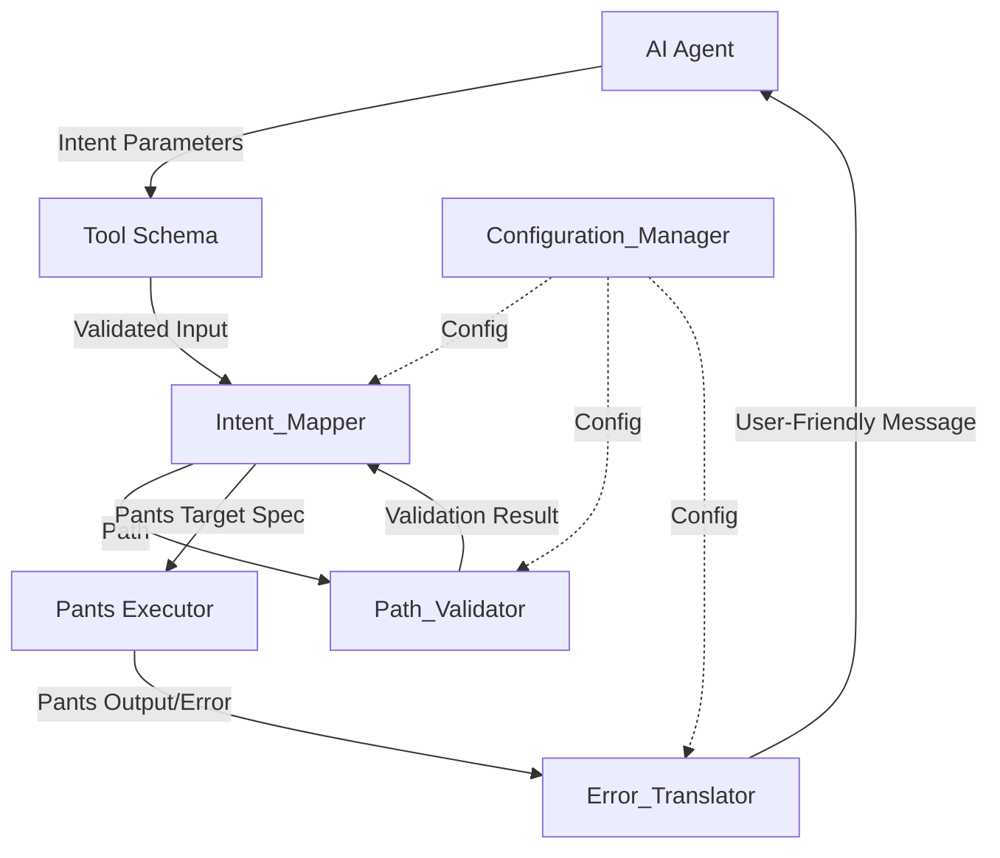
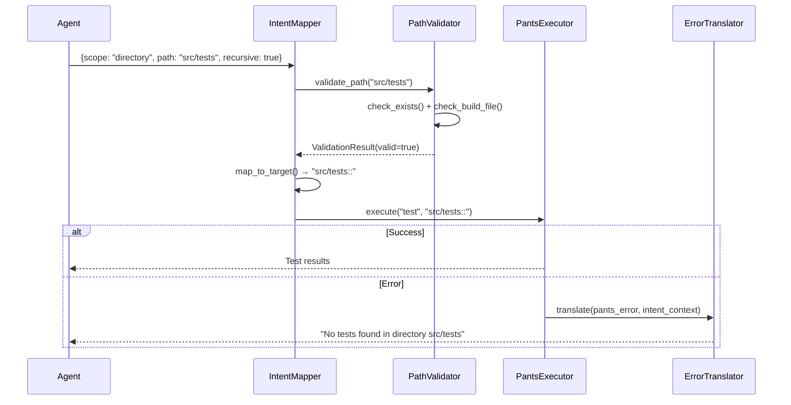

# Design Document: Intent-Based API Layer for Pants Target Validation

## Overview

This design specifies an intent-based API layer that abstracts Pants target syntax behind a clear, user-friendly interface. Instead of requiring AI agents to understand Pants target addressing (`:`, `::`, target generators, BUILD files), the system accepts high-level intents like "test all", "test this directory", or "test this file" and internally maps them to appropriate Pants target specifications.

The system consists of four core components:

1. **Intent_Mapper**: Translates user intents (scope + path + recursive flag) into Pants target specifications
2. **Path_Validator**: Validates file/directory existence and BUILD file presence before execution
3. **Error_Translator**: Converts Pants error messages into intent-based, user-friendly language
4. **Configuration_Manager**: Manages system behavior through configurable options

This design hides the complexity of Pants while maintaining full testing power, providing smart defaults, helpful error messages, and fast validation.

## Architecture

### Component Diagram



### Component Interactions

1. **Agent → Tool Schema**: Agent provides intent parameters (scope, path, recursive, test_filter)
2. **Tool Schema → Intent_Mapper**: Validated parameters passed to mapper
3. **Intent_Mapper → Path_Validator**: Requests path validation before mapping
4. **Path_Validator → Intent_Mapper**: Returns validation result (success/error)
5. **Intent_Mapper → Pants Executor**: Provides resolved Pants target specification
6. **Pants Executor → Error_Translator**: Passes any Pants errors for translation
7. **Error_Translator → Agent**: Returns user-friendly error messages
8. **Configuration_Manager**: Provides configuration to all components

### Data Flow



## Components and Interfaces

### Intent_Mapper

**Responsibility**: Translates user intents into Pants target specifications.

**Interface**:

```python
class IntentMapper:
    def __init__(self, config: Configuration, validator: PathValidator):
        """Initialize with configuration and path validator."""
        pass
    
    def map_intent(
        self,
        scope: Literal["all", "directory", "file"],
        path: Optional[str] = None,
        recursive: bool = True,
        test_filter: Optional[str] = None
    ) -> MappingResult:
        """
        Map user intent to Pants target specification.
        
        Returns:
            MappingResult containing target spec and additional Pants options
        
        Raises:
            ValidationError: If path validation fails
            IntentError: If intent parameters are invalid
        """
        pass
    
    def resolve_defaults(
        self,
        scope: Optional[str],
        path: Optional[str],
        recursive: Optional[bool]
    ) -> ResolvedIntent:
        """Apply smart defaults to incomplete intent parameters."""
        pass
```

**Mapping Logic**:

```python
def _map_scope_to_target(scope: str, path: str, recursive: bool) -> str:
    """
    Core mapping algorithm:
    
    - scope="all", path=None → "::"
    - scope="directory", path="src/tests", recursive=True → "src/tests::"
    - scope="directory", path="src/tests", recursive=False → "src/tests:"
    - scope="file", path="src/test.py" → "src/test.py"
    - scope="directory", path="" → "::" (root directory)
    """
    if scope == "all":
        return "::"
    
    if scope == "directory":
        if not path or path == ".":
            return "::"
        suffix = "::" if recursive else ":"
        return f"{path.rstrip('/')}{suffix}"
    
    if scope == "file":
        return path
    
    raise IntentError(f"Unknown scope: {scope}")
```

**Test Filter Handling**:

```python
def _add_test_filter(base_options: List[str], test_filter: Optional[str]) -> List[str]:
    """
    Add pytest-style test filtering to Pants command.
    
    test_filter="test_create" → ["-k", "test_create"]
    test_filter="test_create or test_update" → ["-k", "test_create or test_update"]
    """
    if test_filter:
        return base_options + ["-k", test_filter]
    return base_options
```

### Path_Validator

**Responsibility**: Validates paths and BUILD file presence before execution.

**Interface**:

```python
class PathValidator:
    def __init__(self, config: Configuration, repo_root: Path):
        """Initialize with configuration and repository root."""
        self._build_file_cache: Dict[str, BuildFileResult] = {}
        self._cache_ttl: int = 60  # seconds
        pass
    
    def validate_path(
        self,
        path: str,
        scope: Literal["all", "directory", "file"]
    ) -> ValidationResult:
        """
        Validate path exists and is appropriate for scope.
        
        Returns:
            ValidationResult with success status and error message if failed
        """
        pass
    
    def check_build_file(self, directory: str) -> BuildFileResult:
        """
        Check if BUILD file exists in directory or parent directories.
        
        Returns:
            BuildFileResult indicating presence and location of BUILD file
        """
        pass
    
    def clear_cache(self):
        """Clear the BUILD file detection cache."""
        pass
```

**Validation Algorithm**:

```python
def validate_path(self, path: str, scope: str) -> ValidationResult:
    """
    Validation steps:
    
    1. If scope="all" and path is None → valid (no path needed)
    2. If scope="file":
       a. Check file exists
       b. Return error if not found
    3. If scope="directory":
       a. Check directory exists
       b. Check BUILD file in directory or parents (with caching)
       c. Return suggestion to run "pants tailor" if no BUILD file
    4. All checks pass → return success
    """
    if scope == "all" and path is None:
        return ValidationResult(valid=True)
    
    if scope == "file":
        if not self._file_exists(path):
            return ValidationResult(
                valid=False,
                error=f"Path does not exist: {path}"
            )
        return ValidationResult(valid=True)
    
    if scope == "directory":
        if not self._directory_exists(path):
            return ValidationResult(
                valid=False,
                error=f"Path does not exist: {path}"
            )
        
        build_result = self.check_build_file(path)
        if not build_result.found:
            return ValidationResult(
                valid=False,
                error=f"No BUILD file found for {path}. Run 'pants tailor' to generate BUILD files",
                suggestion="pants tailor"
            )
        
        return ValidationResult(valid=True)
    
    return ValidationResult(valid=False, error=f"Unknown scope: {scope}")
```

**BUILD File Detection with Caching**:

```python
def check_build_file(self, directory: str) -> BuildFileResult:
    """
    Check for BUILD file with caching for performance.
    
    Algorithm:
    1. Check cache for recent result (within TTL)
    2. If not cached, traverse up to 5 parent directories
    3. Look for BUILD, BUILD.pants, or BUILD.bazel files
    4. Cache result with timestamp
    5. Return result
    """
    # Check cache
    cache_key = directory
    if cache_key in self._build_file_cache:
        cached = self._build_file_cache[cache_key]
        if time.time() - cached.timestamp < self._cache_ttl:
            return cached.result
    
    # Search for BUILD file
    current = Path(self.repo_root) / directory
    max_depth = 5
    
    for _ in range(max_depth):
        for build_name in ["BUILD", "BUILD.pants", "BUILD.bazel"]:
            build_path = current / build_name
            if build_path.exists():
                result = BuildFileResult(found=True, location=str(current))
                self._cache_result(cache_key, result)
                return result
        
        if current == self.repo_root:
            break
        current = current.parent
    
    result = BuildFileResult(found=False)
    self._cache_result(cache_key, result)
    return result
```


### Error_Translator

**Responsibility**: Converts Pants error messages into intent-based, user-friendly language.

**Interface**:

```python
class ErrorTranslator:
    def __init__(self, config: Configuration):
        """Initialize with configuration."""
        self._translation_rules: List[TranslationRule] = self._load_rules()
        pass
    
    def translate_error(
        self,
        pants_error: str,
        intent_context: IntentContext
    ) -> TranslatedError:
        """
        Translate Pants error to user-friendly message.
        
        Args:
            pants_error: Raw error message from Pants
            intent_context: Original intent parameters for context
        
        Returns:
            TranslatedError with user-friendly message and raw error
        """
        pass
    
    def add_translation_rule(self, rule: TranslationRule):
        """Add custom translation rule."""
        pass
```

**Translation Rules**:

```python
class TranslationRule:
    """Pattern-based translation rule."""
    pattern: str  # Regex pattern to match in Pants error
    template: str  # Template for user-friendly message
    priority: int  # Higher priority rules checked first
    
    def matches(self, error: str) -> bool:
        """Check if this rule matches the error."""
        return re.search(self.pattern, error) is not None
    
    def apply(self, error: str, context: IntentContext) -> str:
        """Apply translation using template and context."""
        match = re.search(self.pattern, error)
        return self.template.format(
            scope=context.scope,
            path=context.path or "repository",
            **match.groupdict()
        )

# Default translation rules
DEFAULT_RULES = [
    TranslationRule(
        pattern=r"No targets? found",
        template="No tests found in {scope} {path}",
        priority=10
    ),
    TranslationRule(
        pattern=r"Unknown target",
        template="Path contains no testable code: {path}",
        priority=10
    ),
    TranslationRule(
        pattern=r"BUILD file not found",
        template="Directory not configured for Pants. Run 'pants tailor' to set up BUILD files",
        priority=10
    ),
    TranslationRule(
        pattern=r"No such file or directory",
        template="Path does not exist: {path}",
        priority=10
    ),
]
```

**Translation Algorithm**:

```python
def translate_error(self, pants_error: str, intent_context: IntentContext) -> TranslatedError:
    """
    Translation steps:
    
    1. Sort rules by priority (highest first)
    2. Try each rule's pattern against error
    3. Apply first matching rule's template
    4. If no rule matches, return generic message with raw error
    5. Always preserve raw error for debugging
    """
    sorted_rules = sorted(self._translation_rules, key=lambda r: r.priority, reverse=True)
    
    for rule in sorted_rules:
        if rule.matches(pants_error):
            user_message = rule.apply(pants_error, intent_context)
            return TranslatedError(
                message=user_message,
                raw_error=pants_error,
                rule_applied=rule.pattern
            )
    
    # No rule matched - return generic message
    return TranslatedError(
        message=f"Pants command failed. Error: {pants_error}",
        raw_error=pants_error,
        rule_applied=None
    )
```

### Configuration_Manager

**Responsibility**: Manages system configuration and provides it to components.

**Interface**:

```python
class Configuration:
    """Configuration for intent-based API behavior."""
    
    # Path validation settings
    enable_path_validation: bool = True
    enable_build_file_checking: bool = True
    build_file_cache_ttl: int = 60  # seconds
    max_parent_directory_depth: int = 5
    
    # Error translation settings
    enable_error_translation: bool = True
    custom_translation_rules: List[TranslationRule] = []
    
    # Performance settings
    path_validation_timeout: int = 10  # milliseconds
    build_file_check_timeout: int = 50  # milliseconds
    log_performance_warnings: bool = True
    
    # Default behavior
    default_scope: str = "all"
    default_recursive: bool = True
    
    @classmethod
    def from_file(cls, path: str) -> "Configuration":
        """Load configuration from file."""
        pass
    
    @classmethod
    def from_dict(cls, data: dict) -> "Configuration":
        """Create configuration from dictionary."""
        pass

class ConfigurationManager:
    def __init__(self, config_path: Optional[str] = None):
        """Initialize with optional config file path."""
        self.config = self._load_config(config_path)
    
    def _load_config(self, path: Optional[str]) -> Configuration:
        """Load configuration from file or use defaults."""
        if path and Path(path).exists():
            return Configuration.from_file(path)
        return Configuration()
    
    def get_config(self) -> Configuration:
        """Get current configuration."""
        return self.config
    
    def update_config(self, updates: dict):
        """Update configuration at runtime."""
        pass
```

## Data Models

### Intent Models

```python
from dataclasses import dataclass
from typing import Optional, Literal

@dataclass
class IntentContext:
    """User's original intent parameters."""
    scope: Literal["all", "directory", "file"]
    path: Optional[str]
    recursive: bool
    test_filter: Optional[str]

@dataclass
class ResolvedIntent:
    """Intent after applying defaults."""
    scope: str
    path: Optional[str]
    recursive: bool
    test_filter: Optional[str]
    defaults_applied: dict  # Which defaults were used

@dataclass
class MappingResult:
    """Result of intent-to-target mapping."""
    target_spec: str  # Pants target specification
    additional_options: List[str]  # Additional Pants CLI options
    resolved_intent: ResolvedIntent
```

### Validation Models

```python
@dataclass
class ValidationResult:
    """Result of path validation."""
    valid: bool
    error: Optional[str] = None
    suggestion: Optional[str] = None  # Suggested command to fix issue
    warnings: List[str] = None

@dataclass
class BuildFileResult:
    """Result of BUILD file detection."""
    found: bool
    location: Optional[str] = None  # Directory where BUILD file was found
    timestamp: float = 0.0  # For caching

@dataclass
class CachedBuildFileResult:
    """Cached BUILD file detection result."""
    result: BuildFileResult
    timestamp: float
```

### Error Models

```python
@dataclass
class TranslatedError:
    """Translated error message."""
    message: str  # User-friendly message
    raw_error: str  # Original Pants error
    rule_applied: Optional[str]  # Pattern of rule that matched
    suggestion: Optional[str] = None  # Suggested fix

@dataclass
class TranslationRule:
    """Rule for translating Pants errors."""
    pattern: str  # Regex pattern
    template: str  # Message template
    priority: int = 5
```

### Tool Schema Models

```python
@dataclass
class ToolParameter:
    """Parameter definition for tool schema."""
    name: str
    type: str
    description: str
    required: bool
    default: Optional[any]
    examples: List[str]

@dataclass
class ToolSchema:
    """Complete tool schema for AI agents."""
    name: str
    description: str
    parameters: List[ToolParameter]
    examples: List[dict]
```

## Tool Schema Structure

### pants_test Tool Schema

```json
{
  "name": "pants_test",
  "description": "Run tests using Pants build system with intent-based parameters",
  "parameters": {
    "scope": {
      "type": "string",
      "enum": ["all", "directory", "file"],
      "description": "What to test: 'all' runs all tests recursively, 'directory' runs tests in a specific directory, 'file' runs tests in a specific file",
      "required": false,
      "default": "all"
    },
    "path": {
      "type": "string",
      "description": "Path to directory or file (required for 'directory' and 'file' scopes). Examples: 'src/tests', 'src/tests/test_auth.py'",
      "required": false,
      "default": null
    },
    "recursive": {
      "type": "boolean",
      "description": "Include subdirectories when testing a directory (only applies to 'directory' scope)",
      "required": false,
      "default": true
    },
    "test_filter": {
      "type": "string",
      "description": "Run only tests matching this name pattern (uses pytest-style filtering). Examples: 'test_create', 'test_create or test_update', 'not test_slow'",
      "required": false,
      "default": null
    }
  },
  "examples": [
    {
      "description": "Run all tests in the repository",
      "parameters": {
        "scope": "all"
      }
    },
    {
      "description": "Run all tests in a directory and its subdirectories",
      "parameters": {
        "scope": "directory",
        "path": "src/tests",
        "recursive": true
      }
    },
    {
      "description": "Run tests in a single directory (not subdirectories)",
      "parameters": {
        "scope": "directory",
        "path": "src/tests",
        "recursive": false
      }
    },
    {
      "description": "Run tests in a specific file",
      "parameters": {
        "scope": "file",
        "path": "src/tests/test_auth.py"
      }
    },
    {
      "description": "Run specific test functions in all tests",
      "parameters": {
        "scope": "all",
        "test_filter": "test_create"
      }
    },
    {
      "description": "Run specific test in a directory",
      "parameters": {
        "scope": "directory",
        "path": "src/tests",
        "test_filter": "test_authentication"
      }
    }
  ]
}
```

### Unified Schema for All Pants Commands

The same intent-based parameters apply to all Pants commands (test, lint, check, fix, format, package):

```python
COMMON_INTENT_PARAMETERS = {
    "scope": ToolParameter(
        name="scope",
        type="string",
        description="What to operate on: 'all', 'directory', or 'file'",
        required=False,
        default="all",
        examples=["all", "directory", "file"]
    ),
    "path": ToolParameter(
        name="path",
        type="string",
        description="Path to directory or file",
        required=False,
        default=None,
        examples=["src/app", "src/app/main.py"]
    ),
    "recursive": ToolParameter(
        name="recursive",
        type="boolean",
        description="Include subdirectories (for directory scope)",
        required=False,
        default=True,
        examples=[True, False]
    )
}

# Command-specific parameters
TEST_SPECIFIC_PARAMETERS = {
    "test_filter": ToolParameter(
        name="test_filter",
        type="string",
        description="Filter tests by name pattern",
        required=False,
        default=None,
        examples=["test_create", "test_create or test_update"]
    )
}
```


## Algorithm Details

### Intent Resolution Algorithm

**Purpose**: Apply smart defaults to incomplete intent parameters.

```python
def resolve_intent(
    scope: Optional[str],
    path: Optional[str],
    recursive: Optional[bool],
    test_filter: Optional[str]
) -> ResolvedIntent:
    """
    Apply defaults and validate intent parameters.
    
    Rules:
    1. If scope is None → default to "all"
    2. If scope is "directory" and path is None → default to current directory
    3. If scope is "directory" and recursive is None → default to True
    4. If scope is "file" and path is None → raise error (path required)
    5. If scope is "all" and path is provided → ignore path (log warning)
    
    Returns:
        ResolvedIntent with all parameters filled in
    """
    defaults_applied = {}
    
    # Apply scope default
    if scope is None:
        scope = "all"
        defaults_applied["scope"] = "all"
    
    # Validate and apply path defaults
    if scope == "file" and path is None:
        raise IntentError("scope='file' requires a path parameter")
    
    if scope == "directory" and path is None:
        path = "."  # Current directory
        defaults_applied["path"] = "."
    
    if scope == "all" and path is not None:
        # Log warning but don't fail
        logger.warning(f"scope='all' ignores path parameter: {path}")
        path = None
    
    # Apply recursive default
    if recursive is None:
        recursive = True
        defaults_applied["recursive"] = True
    
    return ResolvedIntent(
        scope=scope,
        path=path,
        recursive=recursive,
        test_filter=test_filter,
        defaults_applied=defaults_applied
    )
```

### Path Validation Algorithm

**Purpose**: Validate paths efficiently with caching.

```python
def validate_path_with_timing(
    path: str,
    scope: str,
    config: Configuration
) -> Tuple[ValidationResult, float]:
    """
    Validate path with performance tracking.
    
    Steps:
    1. Start timer
    2. Check if validation is enabled in config
    3. Perform appropriate validation based on scope
    4. Check BUILD file if needed (with caching)
    5. Stop timer and check against thresholds
    6. Log warning if validation took too long
    7. Return result and elapsed time
    """
    start_time = time.perf_counter()
    
    # Skip validation if disabled
    if not config.enable_path_validation:
        return ValidationResult(valid=True), 0.0
    
    # Perform validation
    if scope == "all":
        result = ValidationResult(valid=True)
    elif scope == "file":
        result = _validate_file(path, config)
    elif scope == "directory":
        result = _validate_directory(path, config)
    else:
        result = ValidationResult(valid=False, error=f"Unknown scope: {scope}")
    
    # Check timing
    elapsed_ms = (time.perf_counter() - start_time) * 1000
    
    if config.log_performance_warnings:
        if scope == "file" and elapsed_ms > config.path_validation_timeout:
            logger.warning(f"File validation took {elapsed_ms:.2f}ms (threshold: {config.path_validation_timeout}ms)")
        elif scope == "directory" and elapsed_ms > config.build_file_check_timeout:
            logger.warning(f"Directory validation took {elapsed_ms:.2f}ms (threshold: {config.build_file_check_timeout}ms)")
    
    return result, elapsed_ms

def _validate_file(path: str, config: Configuration) -> ValidationResult:
    """Validate file exists."""
    file_path = Path(path)
    if not file_path.exists():
        return ValidationResult(
            valid=False,
            error=f"Path does not exist: {path}"
        )
    if not file_path.is_file():
        return ValidationResult(
            valid=False,
            error=f"Path is not a file: {path}"
        )
    return ValidationResult(valid=True)

def _validate_directory(path: str, config: Configuration) -> ValidationResult:
    """Validate directory exists and has BUILD file."""
    dir_path = Path(path)
    
    # Check directory exists
    if not dir_path.exists():
        return ValidationResult(
            valid=False,
            error=f"Path does not exist: {path}"
        )
    if not dir_path.is_dir():
        return ValidationResult(
            valid=False,
            error=f"Path is not a directory: {path}"
        )
    
    # Check BUILD file if enabled
    if config.enable_build_file_checking:
        build_result = check_build_file_cached(path, config)
        if not build_result.found:
            return ValidationResult(
                valid=False,
                error=f"No BUILD file found for {path}. Run 'pants tailor' to generate BUILD files",
                suggestion="pants tailor"
            )
    
    return ValidationResult(valid=True)
```

### BUILD File Detection Algorithm

**Purpose**: Efficiently detect BUILD files with caching.

```python
# Module-level cache
_build_file_cache: Dict[str, CachedBuildFileResult] = {}

def check_build_file_cached(
    directory: str,
    config: Configuration
) -> BuildFileResult:
    """
    Check for BUILD file with caching.
    
    Algorithm:
    1. Generate cache key from directory path
    2. Check if result is in cache and still valid (within TTL)
    3. If cached and valid, return cached result
    4. Otherwise, perform fresh search
    5. Cache the result with current timestamp
    6. Return result
    """
    cache_key = str(Path(directory).resolve())
    current_time = time.time()
    
    # Check cache
    if cache_key in _build_file_cache:
        cached = _build_file_cache[cache_key]
        age = current_time - cached.timestamp
        if age < config.build_file_cache_ttl:
            return cached.result
    
    # Perform fresh search
    result = _search_build_file(directory, config)
    
    # Cache result
    _build_file_cache[cache_key] = CachedBuildFileResult(
        result=result,
        timestamp=current_time
    )
    
    return result

def _search_build_file(directory: str, config: Configuration) -> BuildFileResult:
    """
    Search for BUILD file in directory and parents.
    
    Algorithm:
    1. Start at specified directory
    2. Check for BUILD, BUILD.pants, or BUILD.bazel
    3. If found, return success with location
    4. Move to parent directory
    5. Repeat up to max_parent_directory_depth times
    6. If not found, return failure
    """
    current = Path(directory).resolve()
    repo_root = Path.cwd()  # Assume current directory is repo root
    
    for depth in range(config.max_parent_directory_depth):
        # Check for BUILD files
        for build_name in ["BUILD", "BUILD.pants", "BUILD.bazel"]:
            build_path = current / build_name
            if build_path.exists():
                return BuildFileResult(
                    found=True,
                    location=str(current)
                )
        
        # Stop at repo root
        if current == repo_root:
            break
        
        # Move to parent
        current = current.parent
    
    return BuildFileResult(found=False)

def clear_build_file_cache():
    """Clear the BUILD file cache (useful for testing or after running tailor)."""
    global _build_file_cache
    _build_file_cache.clear()
```

### Error Translation Algorithm

**Purpose**: Convert Pants errors to user-friendly messages.

```python
def translate_error_with_context(
    pants_error: str,
    intent_context: IntentContext,
    config: Configuration
) -> TranslatedError:
    """
    Translate Pants error with full context.
    
    Algorithm:
    1. Check if translation is enabled
    2. If disabled, return raw error
    3. Load translation rules (default + custom)
    4. Sort rules by priority
    5. Try each rule's pattern
    6. Apply first matching rule
    7. If no match, return generic message
    8. Always include raw error for debugging
    """
    # Skip translation if disabled
    if not config.enable_error_translation:
        return TranslatedError(
            message=pants_error,
            raw_error=pants_error,
            rule_applied=None
        )
    
    # Load all rules
    all_rules = DEFAULT_RULES + config.custom_translation_rules
    sorted_rules = sorted(all_rules, key=lambda r: r.priority, reverse=True)
    
    # Try each rule
    for rule in sorted_rules:
        if rule.matches(pants_error):
            try:
                user_message = rule.apply(pants_error, intent_context)
                return TranslatedError(
                    message=user_message,
                    raw_error=pants_error,
                    rule_applied=rule.pattern,
                    suggestion=_extract_suggestion(rule, pants_error)
                )
            except Exception as e:
                logger.error(f"Error applying translation rule {rule.pattern}: {e}")
                continue
    
    # No rule matched
    return TranslatedError(
        message=f"Pants command failed. Error: {pants_error}",
        raw_error=pants_error,
        rule_applied=None
    )

def _extract_suggestion(rule: TranslationRule, error: str) -> Optional[str]:
    """Extract actionable suggestion from error."""
    if "BUILD file" in error or "tailor" in rule.template:
        return "pants tailor"
    return None
```

### Complete Intent Mapping Flow

**Purpose**: End-to-end flow from intent to Pants command.

```python
def map_intent_to_pants_command(
    scope: Optional[str],
    path: Optional[str],
    recursive: Optional[bool],
    test_filter: Optional[str],
    config: Configuration
) -> Tuple[str, List[str], IntentContext]:
    """
    Complete flow from intent to Pants command.
    
    Steps:
    1. Resolve intent with defaults
    2. Validate path (if applicable)
    3. Map scope to target specification
    4. Add test filter options (if applicable)
    5. Return target spec, options, and context
    
    Returns:
        (target_spec, additional_options, intent_context)
    
    Raises:
        ValidationError: If validation fails
        IntentError: If intent is invalid
    """
    # Step 1: Resolve intent
    resolved = resolve_intent(scope, path, recursive, test_filter)
    
    # Step 2: Validate path
    if config.enable_path_validation:
        validation_result, elapsed_ms = validate_path_with_timing(
            resolved.path,
            resolved.scope,
            config
        )
        if not validation_result.valid:
            raise ValidationError(
                validation_result.error,
                suggestion=validation_result.suggestion
            )
    
    # Step 3: Map to target spec
    target_spec = _map_scope_to_target(
        resolved.scope,
        resolved.path,
        resolved.recursive
    )
    
    # Step 4: Add test filter
    additional_options = []
    if resolved.test_filter:
        additional_options = ["-k", resolved.test_filter]
    
    # Step 5: Create context for error translation
    intent_context = IntentContext(
        scope=resolved.scope,
        path=resolved.path,
        recursive=resolved.recursive,
        test_filter=resolved.test_filter
    )
    
    return target_spec, additional_options, intent_context
```


## Performance Considerations

### Caching Strategy

**BUILD File Cache**:
- Cache BUILD file detection results for 60 seconds (configurable)
- Key: Absolute path to directory
- Value: BuildFileResult with timestamp
- Invalidation: Time-based (TTL) or manual clear after running `pants tailor`

**Performance Targets**:
- File existence check: < 10ms
- Directory existence check: < 10ms
- BUILD file detection: < 50ms (with caching)
- Overall validation: < 100ms

**Cache Management**:

```python
def clear_cache_after_tailor():
    """Clear BUILD file cache after running pants tailor."""
    clear_build_file_cache()
    logger.info("BUILD file cache cleared after tailor")

def get_cache_stats() -> dict:
    """Get cache statistics for monitoring."""
    return {
        "size": len(_build_file_cache),
        "oldest_entry": min(
            (c.timestamp for c in _build_file_cache.values()),
            default=None
        ),
        "newest_entry": max(
            (c.timestamp for c in _build_file_cache.values()),
            default=None
        )
    }
```

### Timeout Handling

```python
def validate_with_timeout(
    path: str,
    scope: str,
    timeout_ms: int
) -> ValidationResult:
    """
    Validate path with timeout protection.
    
    If validation exceeds timeout, return success with warning
    to avoid blocking execution.
    """
    start = time.perf_counter()
    result = validate_path(path, scope)
    elapsed_ms = (time.perf_counter() - start) * 1000
    
    if elapsed_ms > timeout_ms:
        logger.warning(f"Validation timeout exceeded: {elapsed_ms:.2f}ms > {timeout_ms}ms")
        # Return success to avoid blocking, but add warning
        result.warnings = result.warnings or []
        result.warnings.append(f"Validation took {elapsed_ms:.2f}ms")
    
    return result
```

### Optimization Strategies

1. **Lazy Validation**: Only validate when path validation is enabled
2. **Early Exit**: Return immediately for scope="all" (no path to validate)
3. **Parallel Validation**: For multiple paths, validate in parallel
4. **Cache Warming**: Pre-populate cache for common directories
5. **Async Validation**: Validate in background while preparing command

## Configuration Options

### Configuration File Format

```yaml
# .kiro-pants-config.yaml

# Path validation settings
path_validation:
  enabled: true
  build_file_checking: true
  cache_ttl_seconds: 60
  max_parent_depth: 5
  timeout_ms: 100

# Error translation settings
error_translation:
  enabled: true
  custom_rules:
    - pattern: "No such file"
      template: "File not found: {path}"
      priority: 10

# Default behavior
defaults:
  scope: "all"
  recursive: true

# Performance settings
performance:
  log_warnings: true
  file_check_timeout_ms: 10
  directory_check_timeout_ms: 10
  build_check_timeout_ms: 50
```

### Runtime Configuration

```python
# Update configuration at runtime
config_manager = ConfigurationManager()
config_manager.update_config({
    "enable_path_validation": False,
    "enable_error_translation": True
})

# Temporarily disable validation
with config_manager.temporary_config(enable_path_validation=False):
    # Validation disabled in this context
    result = map_intent_to_pants_command(...)
```

### Environment Variables

```bash
# Override configuration via environment
export KIRO_PANTS_VALIDATE_PATHS=false
export KIRO_PANTS_CHECK_BUILD_FILES=true
export KIRO_PANTS_CACHE_TTL=120
export KIRO_PANTS_TRANSLATE_ERRORS=true
```

## Error Handling

### Error Hierarchy

```python
class IntentError(Exception):
    """Base exception for intent-related errors."""
    pass

class ValidationError(IntentError):
    """Path validation failed."""
    def __init__(self, message: str, suggestion: Optional[str] = None):
        super().__init__(message)
        self.suggestion = suggestion

class MappingError(IntentError):
    """Intent mapping failed."""
    pass

class ConfigurationError(IntentError):
    """Configuration is invalid."""
    pass
```

### Error Response Format

```python
@dataclass
class ErrorResponse:
    """Standardized error response."""
    success: bool = False
    error_type: str  # "validation", "mapping", "pants", "configuration"
    message: str  # User-friendly message
    raw_error: Optional[str] = None  # Original error for debugging
    suggestion: Optional[str] = None  # Suggested fix
    context: Optional[dict] = None  # Additional context
```

### Error Handling Strategy

```python
def execute_with_error_handling(
    scope: str,
    path: Optional[str],
    recursive: bool,
    test_filter: Optional[str],
    config: Configuration
) -> Union[SuccessResponse, ErrorResponse]:
    """
    Execute with comprehensive error handling.
    
    Error handling flow:
    1. Catch ValidationError → return validation error response
    2. Catch MappingError → return mapping error response
    3. Catch Pants execution error → translate and return
    4. Catch unexpected errors → log and return generic error
    """
    try:
        # Map intent to Pants command
        target_spec, options, context = map_intent_to_pants_command(
            scope, path, recursive, test_filter, config
        )
        
        # Execute Pants command
        result = execute_pants_command("test", target_spec, options)
        
        return SuccessResponse(
            success=True,
            output=result.stdout,
            target_spec=target_spec
        )
        
    except ValidationError as e:
        return ErrorResponse(
            error_type="validation",
            message=str(e),
            suggestion=e.suggestion,
            context={"scope": scope, "path": path}
        )
    
    except MappingError as e:
        return ErrorResponse(
            error_type="mapping",
            message=str(e),
            context={"scope": scope, "path": path, "recursive": recursive}
        )
    
    except PantsExecutionError as e:
        translated = translate_error_with_context(
            e.stderr,
            IntentContext(scope, path, recursive, test_filter),
            config
        )
        return ErrorResponse(
            error_type="pants",
            message=translated.message,
            raw_error=translated.raw_error,
            suggestion=translated.suggestion,
            context={"target_spec": target_spec}
        )
    
    except Exception as e:
        logger.exception("Unexpected error in intent execution")
        return ErrorResponse(
            error_type="internal",
            message="An unexpected error occurred",
            raw_error=str(e)
        )
```


## Correctness Properties

A property is a characteristic or behavior that should hold true across all valid executions of a system—essentially, a formal statement about what the system should do. Properties serve as the bridge between human-readable specifications and machine-verifiable correctness guarantees.

### Property Reflection

After analyzing all acceptance criteria, I identified several redundant properties that can be consolidated:

- Requirements 3.1, 3.2, 3.3, 3.4 duplicate requirements 1.2, 1.3, 1.4 → Consolidated into Properties 1-3
- Requirements 7.1, 7.2, 7.4 duplicate requirements 2.4, 2.5 → Covered by Properties 5-6
- Requirements 10.4, 10.5 duplicate requirements 10.1, 10.3 → Covered by Properties 18-19

This consolidation ensures each property provides unique validation value without redundancy.

### Property 1: Scope "all" maps to recursive target

*For any* combination of path, recursive flag, and test_filter parameters, when scope is "all", the Intent_Mapper should map to Pants target "::" regardless of other parameters.

**Validates: Requirements 1.2, 3.1**

### Property 2: Directory scope with recursive maps correctly

*For any* valid directory path, when scope is "directory" and recursive is true, the Intent_Mapper should map to "{path}::" (with trailing double colon).

**Validates: Requirements 1.3, 3.2**

### Property 3: Directory scope without recursive maps correctly

*For any* valid directory path, when scope is "directory" and recursive is false, the Intent_Mapper should map to "{path}:" (with single trailing colon).

**Validates: Requirements 1.3, 3.3**

### Property 4: File scope maps to path directly

*For any* valid file path, when scope is "file", the Intent_Mapper should map to the file path unchanged (no suffix added).

**Validates: Requirements 1.4, 3.4**

### Property 5: File validation detects existence

*For any* file path, the Path_Validator should return valid=true if the file exists and valid=false with error message "Path does not exist: {path}" if it does not exist.

**Validates: Requirements 2.1, 2.3**

### Property 6: Directory validation detects existence

*For any* directory path, the Path_Validator should return valid=true if the directory exists and valid=false with error message "Path does not exist: {path}" if it does not exist.

**Validates: Requirements 2.2, 2.3**

### Property 7: BUILD file detection searches parent directories

*For any* directory path, when checking for BUILD files, the Path_Validator should search up to max_parent_directory_depth parent directories and return found=true if any BUILD, BUILD.pants, or BUILD.bazel file exists in the path or its parents.

**Validates: Requirements 2.4, 7.4**

### Property 8: Missing BUILD file suggests tailor

*For any* directory path without a BUILD file in it or parent directories, the Path_Validator should return an error with suggestion "pants tailor".

**Validates: Requirements 2.5, 7.2**

### Property 9: Test filter adds -k option

*For any* test_filter string, when provided to Intent_Mapper, the resulting additional_options should include ["-k", test_filter].

**Validates: Requirements 4.2, 4.3**

### Property 10: Test filter works with all scopes

*For any* combination of scope (all, directory, file) and test_filter, the Intent_Mapper should successfully combine them, producing both a target spec and the -k option.

**Validates: Requirements 4.5**

### Property 11: Error translation for "No targets found"

*For any* Pants error containing "No targets found" and any intent context, the Error_Translator should return a message in the format "No tests found in {scope} {path}".

**Validates: Requirements 5.1**

### Property 12: Error translation for "Unknown target"

*For any* Pants error containing "Unknown target" and any intent context with a path, the Error_Translator should return "Path contains no testable code: {path}".

**Validates: Requirements 5.2**

### Property 13: Error translation for "BUILD file not found"

*For any* Pants error containing "BUILD file not found", the Error_Translator should return "Directory not configured for Pants. Run 'pants tailor' to set up BUILD files".

**Validates: Requirements 5.3**

### Property 14: Raw error preservation

*For any* Pants error and translation result, the TranslatedError should always contain the original error in the raw_error field.

**Validates: Requirements 5.4**

### Property 15: Fallback translation for unknown errors

*For any* Pants error that doesn't match any translation rule, the Error_Translator should return a generic message that includes the original error text.

**Validates: Requirements 5.5**

### Property 16: Parent BUILD file validates path

*For any* directory path where a BUILD file exists in a parent directory (but not the directory itself), the Path_Validator should return valid=true.

**Validates: Requirements 7.5**

### Property 17: Default scope is "all"

*For any* intent mapping call where scope is None or not provided, the resolved intent should have scope="all".

**Validates: Requirements 8.1**

### Property 18: Default path for directory scope

*For any* intent mapping call where scope is "directory" and path is None, the resolved intent should default path to "." (current directory).

**Validates: Requirements 8.2**

### Property 19: Default recursive is true

*For any* intent mapping call where scope is "directory" and recursive is None, the resolved intent should have recursive=true.

**Validates: Requirements 8.3**

### Property 20: File scope requires path

*For any* intent mapping call where scope is "file" and path is None, the Intent_Mapper should raise an IntentError requiring a path parameter.

**Validates: Requirements 8.5**

### Property 21: BUILD file cache returns same result

*For any* directory path, when check_build_file is called twice within the cache TTL period, the second call should return the same result as the first without performing filesystem operations.

**Validates: Requirements 9.4**

### Property 22: Configuration disables path validation

*For any* intent mapping with configuration enable_path_validation=false, the system should skip path validation and proceed directly to mapping.

**Validates: Requirements 10.1, 10.4**

### Property 23: Configuration disables BUILD file checking

*For any* directory validation with configuration enable_build_file_checking=false, the system should skip BUILD file detection.

**Validates: Requirements 10.2**

### Property 24: Configuration disables error translation

*For any* Pants error with configuration enable_error_translation=false, the Error_Translator should return the original Pants error unchanged in the message field.

**Validates: Requirements 10.3, 10.5**


## Testing Strategy

### Dual Testing Approach

This feature requires both unit tests and property-based tests for comprehensive coverage:

- **Unit tests**: Verify specific examples, edge cases, and integration points
- **Property tests**: Verify universal properties across all inputs

Both approaches are complementary and necessary. Unit tests catch concrete bugs in specific scenarios, while property tests verify general correctness across the input space.

### Property-Based Testing

**Framework**: Use `hypothesis` for Python (the primary implementation language for kiro-pants-power)

**Configuration**:
- Minimum 100 iterations per property test (due to randomization)
- Each test must reference its design document property using a comment tag
- Tag format: `# Feature: pants-target-validation, Property {number}: {property_text}`

**Example Property Test**:

```python
from hypothesis import given, strategies as st
import pytest

# Feature: pants-target-validation, Property 1: Scope "all" maps to recursive target
@given(
    path=st.one_of(st.none(), st.text()),
    recursive=st.booleans(),
    test_filter=st.one_of(st.none(), st.text())
)
@pytest.mark.property_test
def test_scope_all_maps_to_recursive_target(path, recursive, test_filter):
    """Property 1: For any parameters, scope='all' should map to '::'"""
    mapper = IntentMapper(config=Configuration(), validator=mock_validator)
    
    result = mapper.map_intent(
        scope="all",
        path=path,
        recursive=recursive,
        test_filter=test_filter
    )
    
    assert result.target_spec == "::"
```

**Generators for Domain Types**:

```python
# Custom strategies for domain-specific types
@st.composite
def valid_file_paths(draw):
    """Generate valid file paths."""
    parts = draw(st.lists(st.text(min_size=1, max_size=10), min_size=1, max_size=5))
    filename = draw(st.text(min_size=1, max_size=20))
    extension = draw(st.sampled_from([".py", ".txt", ".md", ""]))
    return "/".join(parts) + "/" + filename + extension

@st.composite
def valid_directory_paths(draw):
    """Generate valid directory paths."""
    parts = draw(st.lists(st.text(min_size=1, max_size=10), min_size=1, max_size=5))
    return "/".join(parts)

@st.composite
def test_filter_patterns(draw):
    """Generate pytest-style test filter patterns."""
    pattern_type = draw(st.sampled_from(["simple", "or", "and", "not"]))
    
    if pattern_type == "simple":
        return draw(st.text(min_size=1, max_size=20))
    elif pattern_type == "or":
        p1 = draw(st.text(min_size=1, max_size=20))
        p2 = draw(st.text(min_size=1, max_size=20))
        return f"{p1} or {p2}"
    elif pattern_type == "and":
        p1 = draw(st.text(min_size=1, max_size=20))
        p2 = draw(st.text(min_size=1, max_size=20))
        return f"{p1} and {p2}"
    else:  # not
        p = draw(st.text(min_size=1, max_size=20))
        return f"not {p}"

@st.composite
def pants_errors(draw):
    """Generate realistic Pants error messages."""
    error_type = draw(st.sampled_from([
        "no_targets",
        "unknown_target",
        "build_not_found",
        "no_such_file",
        "other"
    ]))
    
    if error_type == "no_targets":
        return "No targets found matching the specification"
    elif error_type == "unknown_target":
        return "Unknown target: src/tests:nonexistent"
    elif error_type == "build_not_found":
        return "BUILD file not found in directory"
    elif error_type == "no_such_file":
        return "No such file or directory: src/missing.py"
    else:
        return draw(st.text(min_size=10, max_size=100))
```

### Unit Testing

**Focus Areas**:
1. Specific examples from requirements (e.g., scope="all" → "::")
2. Edge cases (empty paths, root directory, special characters)
3. Error conditions (missing files, invalid scopes)
4. Integration between components
5. Configuration loading and validation
6. Cache behavior and invalidation

**Example Unit Tests**:

```python
def test_scope_all_maps_to_double_colon():
    """Specific example: scope='all' should map to '::'"""
    mapper = IntentMapper(config=Configuration(), validator=mock_validator)
    result = mapper.map_intent(scope="all")
    assert result.target_spec == "::"

def test_directory_recursive_true_adds_double_colon():
    """Specific example: directory with recursive=true"""
    mapper = IntentMapper(config=Configuration(), validator=mock_validator)
    result = mapper.map_intent(scope="directory", path="src/tests", recursive=True)
    assert result.target_spec == "src/tests::"

def test_file_scope_without_path_raises_error():
    """Edge case: file scope requires path"""
    mapper = IntentMapper(config=Configuration(), validator=mock_validator)
    with pytest.raises(IntentError, match="requires a path"):
        mapper.map_intent(scope="file", path=None)

def test_empty_path_with_directory_scope_defaults_to_current():
    """Edge case: empty path defaults to current directory"""
    mapper = IntentMapper(config=Configuration(), validator=mock_validator)
    result = mapper.map_intent(scope="directory", path=None)
    assert result.resolved_intent.path == "."

def test_build_file_cache_returns_same_result():
    """Cache behavior: repeated calls return cached result"""
    validator = PathValidator(config=Configuration(), repo_root=Path.cwd())
    
    # First call
    result1 = validator.check_build_file("src/tests")
    
    # Second call (should be cached)
    result2 = validator.check_build_file("src/tests")
    
    assert result1.found == result2.found
    assert result1.location == result2.location

def test_error_translator_preserves_raw_error():
    """Error handling: raw error always preserved"""
    translator = ErrorTranslator(config=Configuration())
    pants_error = "Some Pants error message"
    context = IntentContext(scope="all", path=None, recursive=True, test_filter=None)
    
    result = translator.translate_error(pants_error, context)
    
    assert result.raw_error == pants_error
```

### Integration Testing

**Test Scenarios**:
1. End-to-end flow from intent to Pants command execution
2. Error translation with real Pants errors
3. Configuration changes affecting behavior
4. Cache invalidation after `pants tailor`
5. Performance under various load conditions

**Example Integration Test**:

```python
def test_end_to_end_directory_test_execution(tmp_path):
    """Integration: complete flow from intent to execution"""
    # Setup test repository
    test_dir = tmp_path / "src" / "tests"
    test_dir.mkdir(parents=True)
    (test_dir / "BUILD").write_text("python_tests()")
    (test_dir / "test_example.py").write_text("def test_example(): pass")
    
    # Execute with intent
    config = Configuration()
    mapper = IntentMapper(config=config, validator=PathValidator(config, tmp_path))
    
    target_spec, options, context = mapper.map_intent(
        scope="directory",
        path="src/tests",
        recursive=True
    )
    
    # Verify mapping
    assert target_spec == "src/tests::"
    
    # Execute Pants (mocked in test)
    result = execute_pants_command("test", target_spec, options)
    assert result.success
```

### Test Organization

```
tests/
├── unit/
│   ├── test_intent_mapper.py          # Intent mapping logic
│   ├── test_path_validator.py         # Path validation
│   ├── test_error_translator.py       # Error translation
│   ├── test_configuration.py          # Configuration management
│   └── test_data_models.py            # Data model validation
├── property/
│   ├── test_mapping_properties.py     # Properties 1-4, 9-10
│   ├── test_validation_properties.py  # Properties 5-8, 16
│   ├── test_translation_properties.py # Properties 11-15
│   ├── test_defaults_properties.py    # Properties 17-20
│   └── test_config_properties.py      # Properties 21-24
├── integration/
│   ├── test_end_to_end.py            # Complete workflows
│   ├── test_pants_integration.py     # Real Pants execution
│   └── test_performance.py           # Performance validation
└── conftest.py                        # Shared fixtures and utilities
```

### Coverage Goals

- **Line coverage**: > 90%
- **Branch coverage**: > 85%
- **Property test iterations**: 100 per property (minimum)
- **Integration scenarios**: All major workflows covered

### Continuous Testing

```yaml
# .github/workflows/test.yml
name: Test

on: [push, pull_request]

jobs:
  test:
    runs-on: ubuntu-latest
    steps:
      - uses: actions/checkout@v2
      - name: Set up Python
        uses: actions/setup-python@v2
        with:
          python-version: '3.10'
      - name: Install dependencies
        run: |
          pip install -e .
          pip install pytest hypothesis pytest-cov
      - name: Run unit tests
        run: pytest tests/unit/ -v --cov
      - name: Run property tests
        run: pytest tests/property/ -v --hypothesis-show-statistics
      - name: Run integration tests
        run: pytest tests/integration/ -v
      - name: Check coverage
        run: pytest --cov --cov-report=term --cov-fail-under=90
```

### Test Data Management

**Fixtures for common scenarios**:

```python
# conftest.py
import pytest
from pathlib import Path

@pytest.fixture
def mock_validator():
    """Mock validator that always returns valid."""
    validator = Mock(spec=PathValidator)
    validator.validate_path.return_value = ValidationResult(valid=True)
    return validator

@pytest.fixture
def temp_repo(tmp_path):
    """Create a temporary repository structure."""
    repo = tmp_path / "repo"
    repo.mkdir()
    
    # Create directory structure
    (repo / "src").mkdir()
    (repo / "src" / "tests").mkdir()
    (repo / "src" / "tests" / "BUILD").write_text("python_tests()")
    
    return repo

@pytest.fixture
def default_config():
    """Default configuration for testing."""
    return Configuration(
        enable_path_validation=True,
        enable_build_file_checking=True,
        enable_error_translation=True,
        build_file_cache_ttl=60,
        max_parent_directory_depth=5
    )

@pytest.fixture
def sample_pants_errors():
    """Sample Pants error messages for testing."""
    return {
        "no_targets": "No targets found matching the specification",
        "unknown_target": "Unknown target: src/tests:nonexistent",
        "build_not_found": "BUILD file not found in directory",
        "no_such_file": "No such file or directory: src/missing.py"
    }
```


## Implementation Phases

### Phase 1: Core Intent Mapping (Week 1)

**Deliverables**:
- Intent_Mapper component with scope-to-target mapping
- ResolvedIntent and MappingResult data models
- Default value resolution logic
- Unit tests for mapping logic
- Property tests for Properties 1-4

**Success Criteria**:
- All scope types (all, directory, file) map correctly
- Defaults applied correctly
- Properties 1-4 pass with 100+ iterations

### Phase 2: Path Validation (Week 2)

**Deliverables**:
- Path_Validator component
- File and directory existence checking
- BUILD file detection with parent directory search
- Caching mechanism for BUILD file results
- ValidationResult and BuildFileResult data models
- Unit tests for validation logic
- Property tests for Properties 5-8, 16

**Success Criteria**:
- Path validation completes within performance targets
- BUILD file detection searches up to 5 parent directories
- Cache reduces repeated filesystem operations
- Properties 5-8, 16 pass with 100+ iterations

### Phase 3: Error Translation (Week 3)

**Deliverables**:
- Error_Translator component
- Translation rules for common Pants errors
- TranslatedError and TranslationRule data models
- Custom rule support
- Unit tests for translation logic
- Property tests for Properties 11-15

**Success Criteria**:
- All default translation rules work correctly
- Raw errors always preserved
- Fallback translation handles unknown errors
- Properties 11-15 pass with 100+ iterations

### Phase 4: Configuration and Integration (Week 4)

**Deliverables**:
- Configuration_Manager component
- Configuration file loading (YAML)
- Environment variable support
- Runtime configuration updates
- Integration of all components
- End-to-end workflow implementation
- Property tests for Properties 17-24
- Integration tests

**Success Criteria**:
- Configuration affects component behavior correctly
- All components work together seamlessly
- Properties 17-24 pass with 100+ iterations
- Integration tests cover major workflows

### Phase 5: Tool Schema and Documentation (Week 5)

**Deliverables**:
- Tool schema definitions for all Pants commands
- Intent-based parameter documentation
- Usage examples
- Migration guide from raw Pants syntax
- Performance optimization
- Final testing and bug fixes

**Success Criteria**:
- Tool schemas are clear and agent-friendly
- Documentation avoids Pants internals
- All tests pass
- Performance targets met
- Code coverage > 90%

## Migration Strategy

### For Existing Users

**Current approach** (raw Pants syntax):
```python
pants_test(target="src/tests::")
```

**New approach** (intent-based):
```python
pants_test(scope="directory", path="src/tests", recursive=True)
```

**Migration steps**:
1. Both APIs supported during transition period
2. Deprecation warnings for raw syntax
3. Automatic translation from raw to intent-based
4. Documentation updated with intent-based examples
5. Raw syntax removed in next major version

### Backward Compatibility

```python
def pants_test(
    # New intent-based parameters
    scope: Optional[str] = None,
    path: Optional[str] = None,
    recursive: Optional[bool] = None,
    test_filter: Optional[str] = None,
    
    # Legacy parameter (deprecated)
    target: Optional[str] = None,
    
    # Other Pants options
    **kwargs
):
    """
    Run tests with intent-based or legacy syntax.
    
    If 'target' is provided, use legacy mode with deprecation warning.
    Otherwise, use intent-based mode.
    """
    if target is not None:
        warnings.warn(
            "The 'target' parameter is deprecated. Use scope/path/recursive instead.",
            DeprecationWarning,
            stacklevel=2
        )
        return _execute_legacy_mode(target, **kwargs)
    
    return _execute_intent_mode(scope, path, recursive, test_filter, **kwargs)
```

## Security Considerations

### Path Traversal Prevention

```python
def sanitize_path(path: str, repo_root: Path) -> Path:
    """
    Sanitize path to prevent directory traversal attacks.
    
    - Resolve to absolute path
    - Ensure path is within repository
    - Reject paths with .. components that escape repo
    """
    abs_path = (repo_root / path).resolve()
    
    # Ensure path is within repo
    try:
        abs_path.relative_to(repo_root)
    except ValueError:
        raise ValidationError(f"Path outside repository: {path}")
    
    return abs_path
```

### Command Injection Prevention

```python
def sanitize_test_filter(test_filter: str) -> str:
    """
    Sanitize test filter to prevent command injection.
    
    - Allow only alphanumeric, underscore, space, and, or, not
    - Reject shell metacharacters
    """
    allowed_pattern = r'^[a-zA-Z0-9_\s()]+$|^[a-zA-Z0-9_\s()]+\s+(and|or|not)\s+[a-zA-Z0-9_\s()]+$'
    
    if not re.match(allowed_pattern, test_filter):
        raise ValidationError(f"Invalid test filter pattern: {test_filter}")
    
    return test_filter
```

### Configuration Validation

```python
def validate_configuration(config: Configuration) -> List[str]:
    """
    Validate configuration values.
    
    Returns list of validation errors (empty if valid).
    """
    errors = []
    
    if config.build_file_cache_ttl < 0:
        errors.append("build_file_cache_ttl must be non-negative")
    
    if config.max_parent_directory_depth < 1:
        errors.append("max_parent_directory_depth must be at least 1")
    
    if config.max_parent_directory_depth > 20:
        errors.append("max_parent_directory_depth too large (max 20)")
    
    for timeout in [config.path_validation_timeout, 
                    config.build_file_check_timeout]:
        if timeout < 1:
            errors.append(f"Timeout must be at least 1ms")
    
    return errors
```

## Monitoring and Observability

### Logging Strategy

```python
import logging

logger = logging.getLogger("kiro.pants.intent")

# Log levels:
# DEBUG: Detailed mapping and validation steps
# INFO: Intent resolution, cache hits/misses
# WARNING: Performance issues, deprecated usage
# ERROR: Validation failures, translation failures

def log_intent_mapping(resolved: ResolvedIntent, result: MappingResult):
    """Log intent mapping for observability."""
    logger.info(
        "Intent mapped",
        extra={
            "scope": resolved.scope,
            "path": resolved.path,
            "recursive": resolved.recursive,
            "target_spec": result.target_spec,
            "defaults_applied": resolved.defaults_applied
        }
    )

def log_validation_performance(path: str, elapsed_ms: float):
    """Log validation performance."""
    if elapsed_ms > 50:
        logger.warning(
            f"Slow validation: {path} took {elapsed_ms:.2f}ms",
            extra={"path": path, "elapsed_ms": elapsed_ms}
        )
    else:
        logger.debug(
            f"Validation completed: {path} in {elapsed_ms:.2f}ms",
            extra={"path": path, "elapsed_ms": elapsed_ms}
        )
```

### Metrics Collection

```python
from dataclasses import dataclass
from typing import Dict
import time

@dataclass
class Metrics:
    """Metrics for monitoring system behavior."""
    intent_mappings: int = 0
    validation_calls: int = 0
    validation_failures: int = 0
    cache_hits: int = 0
    cache_misses: int = 0
    error_translations: int = 0
    avg_validation_time_ms: float = 0.0
    
    def record_validation(self, elapsed_ms: float, success: bool):
        """Record validation metrics."""
        self.validation_calls += 1
        if not success:
            self.validation_failures += 1
        
        # Update running average
        n = self.validation_calls
        self.avg_validation_time_ms = (
            (self.avg_validation_time_ms * (n - 1) + elapsed_ms) / n
        )
    
    def record_cache_hit(self):
        """Record cache hit."""
        self.cache_hits += 1
    
    def record_cache_miss(self):
        """Record cache miss."""
        self.cache_misses += 1
    
    def get_cache_hit_rate(self) -> float:
        """Calculate cache hit rate."""
        total = self.cache_hits + self.cache_misses
        return self.cache_hits / total if total > 0 else 0.0
    
    def to_dict(self) -> Dict:
        """Export metrics as dictionary."""
        return {
            "intent_mappings": self.intent_mappings,
            "validation_calls": self.validation_calls,
            "validation_failures": self.validation_failures,
            "validation_failure_rate": (
                self.validation_failures / self.validation_calls
                if self.validation_calls > 0 else 0.0
            ),
            "cache_hits": self.cache_hits,
            "cache_misses": self.cache_misses,
            "cache_hit_rate": self.get_cache_hit_rate(),
            "error_translations": self.error_translations,
            "avg_validation_time_ms": self.avg_validation_time_ms
        }

# Global metrics instance
_metrics = Metrics()

def get_metrics() -> Metrics:
    """Get current metrics."""
    return _metrics

def reset_metrics():
    """Reset metrics (useful for testing)."""
    global _metrics
    _metrics = Metrics()
```

## Future Enhancements

### Potential Improvements

1. **Smart Path Suggestions**: When validation fails, suggest similar valid paths
2. **Intent Templates**: Pre-defined intent combinations for common workflows
3. **Batch Operations**: Support multiple intents in a single call
4. **Async Validation**: Validate paths asynchronously while preparing command
5. **Machine Learning**: Learn from usage patterns to improve defaults
6. **Visual Studio Code Extension**: GUI for intent-based testing
7. **Intent History**: Track and replay previous intents
8. **Performance Profiling**: Detailed breakdown of time spent in each component

### Extensibility Points

```python
class IntentMapperPlugin:
    """Plugin interface for custom intent mapping."""
    
    def can_handle(self, scope: str) -> bool:
        """Check if this plugin can handle the scope."""
        pass
    
    def map(self, scope: str, path: str, **kwargs) -> str:
        """Map intent to target specification."""
        pass

class ValidationPlugin:
    """Plugin interface for custom validation."""
    
    def validate(self, path: str, scope: str) -> ValidationResult:
        """Perform custom validation."""
        pass

class TranslationPlugin:
    """Plugin interface for custom error translation."""
    
    def translate(self, error: str, context: IntentContext) -> Optional[str]:
        """Translate error or return None if not handled."""
        pass
```

## Appendix

### Complete Example Usage

```python
from kiro_pants_power import pants_test, Configuration, ConfigurationManager

# Initialize with configuration
config_manager = ConfigurationManager(".kiro-pants-config.yaml")
config = config_manager.get_config()

# Example 1: Run all tests
result = pants_test(scope="all")

# Example 2: Run tests in a directory recursively
result = pants_test(
    scope="directory",
    path="src/tests",
    recursive=True
)

# Example 3: Run tests in a specific file
result = pants_test(
    scope="file",
    path="src/tests/test_auth.py"
)

# Example 4: Run specific test functions
result = pants_test(
    scope="directory",
    path="src/tests",
    test_filter="test_create or test_update"
)

# Example 5: With custom configuration
with config_manager.temporary_config(enable_path_validation=False):
    result = pants_test(scope="all")  # Skip validation

# Handle results
if result.success:
    print(f"Tests passed: {result.output}")
else:
    print(f"Error: {result.message}")
    if result.suggestion:
        print(f"Suggestion: {result.suggestion}")
    if result.raw_error:
        print(f"Raw error: {result.raw_error}")
```

### Glossary of Terms

- **Intent**: High-level description of what the user wants to accomplish
- **Scope**: The breadth of code to operate on (all, directory, file)
- **Target Specification**: Pants-specific syntax for addressing code (e.g., `::`, `path::`)
- **BUILD File**: Pants configuration file defining targets in a directory
- **Target Generator**: Pants target that generates multiple targets (e.g., `python_tests`)
- **Recursive**: Whether to include subdirectories in the operation
- **Test Filter**: Pattern to select specific test functions (pytest-style)
- **Validation**: Checking that paths exist and are testable before execution
- **Translation**: Converting Pants errors to user-friendly messages
- **Cache**: Temporary storage of validation results to improve performance
- **TTL**: Time To Live - how long cached results remain valid

### References

- [Pants Documentation - Targets and BUILD files](https://www.pantsbuild.org/dev/docs/using-pants/key-concepts/targets-and-build-files)
- [Pants Documentation - Running Tests](https://www.pantsbuild.org/dev/docs/python/goals/test)
- [pytest Documentation - Test Selection](https://docs.pytest.org/en/stable/how-to/usage.html#specifying-tests-selecting-tests)
- [Hypothesis Documentation](https://hypothesis.readthedocs.io/)
- [Property-Based Testing Patterns](https://fsharpforfunandprofit.com/posts/property-based-testing/)

